<p align="center">
  
</p>

# Update (2023-02-02)

Trying to use `text-chat-davinci-002-20230126` with the OpenAI API now returns a 404 error. Someone has already found the new model name, but they are refusing to share it. I will update this repository once I find the new model. If you have any leads, please open an issue or a pull request.

# ChatGPT API

>  A ChatGPT implementation using the official ChatGPT model via OpenAI's API.

[](https://www.npmjs.com/package/@waylaidwanderer/chatgpt-api)
[](https://www.npmjs.com/package/@waylaidwanderer/chatgpt-api)
[](https://github.com/waylaidwanderer/node-chatgpt-api/blob/main/LICENSE)
[](https://github.com/waylaidwanderer/node-chatgpt-api/)

This is an implementation of [ChatGPT](https://chat.openai.com/chat) using the official ChatGPT raw model, `text-chat-davinci-002-20230126`. This model name was briefly leaked while I was  inspecting the network requests made by the official ChatGPT website, and I discovered that it works with the [OpenAI API](https://beta.openai.com/docs/api-reference/completions). **Usage of this model currently does not cost any credits.**

As far as I'm aware, I was the first one who discovered this, and usage of the model has since been implemented in libraries like [acheong08/ChatGPT](https://github.com/acheong08/ChatGPT).

The previous version of this library that used [transitive-bullshit/chatgpt-api](https://github.com/transitive-bullshit/chatgpt-api) is still available on [the `archive/old-version` branch](https://github.com/waylaidwanderer/node-chatgpt-api/tree/archive/old-version).

By itself, the model does not have any conversational support, so this library uses a cache to store conversations and pass them to the model as context. This allows you to have persistent conversations with ChatGPT in a nearly identical way to the official website.

## Features
- Uses the official ChatGPT raw model, `text-chat-davinci-002-20230126`.
- Includes an API server you can run to use ChatGPT in non-Node.js applications.
- Includes a `ChatGPTClient` class that you can use in your own Node.js applications.
- Includes a CLI interface where you can chat with ChatGPT.
- Replicates chat threads from the official ChatGPT website (with conversation IDs and message IDs), with persistent conversations using [Keyv](https://www.npmjs.com/package/keyv).
  - Conversations are stored in memory by default, but you can optionally [install a storage adapter](https://www.npmjs.com/package/keyv#usage) to persist conversations to a database.
  - The `keyv-file` adapter is also included in this package, and can be used to store conversations in a JSON file if you're using the API server or CLI (see `settings.example.js`).
- Supports configurable prompt prefixes, and custom names for the user and ChatGPT.
  - In essence, this allows you to turn ChatGPT into a different character.
  - This is currently only configurable on a global level, but I plan to add support for per-conversation customization.

## Getting Started

### Prerequisites
- Node.js
- npm
- [OpenAI API key](https://platform.openai.com/account/api-keys)

## Usage

### Module
```bash
npm i @waylaidwanderer/chatgpt-api
```

```JS
import ChatGPTClient from '@waylaidwanderer/chatgpt-api';

const clientOptions = {
  // (Optional) Parameters as described in https://platform.openai.com/docs/api-reference/completions
  modelOptions: {
    // The model is set to text-chat-davinci-002-20230126 by default, but you can override
    // it and any other parameters here
    model: 'text-chat-davinci-002-20230126',
  },
  // (Optional) Set a custom prompt prefix. As per my testing it should work with two newlines
  // promptPrefix: 'You are not ChatGPT...\n\n',
  // (Optional) Set a custom name for the user
  // userLabel: 'User',
  // (Optional) Set a custom name for ChatGPT
  // chatGptLabel: 'ChatGPT',
  // (Optional) Set to true to enable `console.debug()` logging
  debug: false,
};

const cacheOptions = {
  // Options for the Keyv cache, see https://www.npmjs.com/package/keyv
  // This is used for storing conversations, and supports additional drivers (conversations are stored in memory by default)
  // For example, to use a JSON file (`npm i keyv-file`) as a database:
  // store: new KeyvFile({ filename: 'cache.json' }),
};

const chatGptClient = new ChatGPTClient('OPENAI_API_KEY', clientOptions, cacheOptions);

const response = await chatGptClient.sendMessage('Hello!');
console.log(response); // { response: 'Hi! How can I help you today?', conversationId: '...', messageId: '...' }

const response2 = await chatGptClient.sendMessage('Write a poem about cats.', { conversationId: response.conversationId, parentMessageId: response.messageId });
console.log(response2.response); // Cats are the best pets in the world.

const response3 = await chatGptClient.sendMessage('Now write it in French.', { conversationId: response2.conversationId, parentMessageId: response2.messageId });
console.log(response3.response); // Les chats sont les meilleurs animaux de compagnie du monde.
```

### API Server
You can install the package using
```bash
npm i -g @waylaidwanderer/chatgpt-api
```
then run it using
`chatgpt-api`.  
This takes an optional `--settings=<path_to_settings.js>` parameter, or looks for `settings.js` in the current directory if not set, with the following contents:
```JS
module.exports = {
  // Your OpenAI API key
  openaiApiKey: '',
  chatGptClient: {
    // (Optional) Parameters as described in https://platform.openai.com/docs/api-reference/completions
    modelOptions: {
      // The model is set to text-chat-davinci-002-20230126 by default, but you can override
      // it and any other parameters here
      model: 'text-chat-davinci-002-20230126',
    },
    // (Optional) Set a custom prompt prefix. As per my testing it should work with two newlines
    // promptPrefix: 'You are not ChatGPT...\n\n',
    // (Optional) Set a custom name for the user
    // userLabel: 'User',
    // (Optional) Set a custom name for ChatGPT
    // chatGptLabel: 'ChatGPT',
    // (Optional) Set to true to enable `console.debug()` logging
    debug: false,
  },
  // Options for the Keyv cache, see https://www.npmjs.com/package/keyv
  // This is used for storing conversations, and supports additional drivers (conversations are stored in memory by default)
  cacheOptions: {},
  // The port the server will run on (optional, defaults to 3000)
  port: 3000,
  // If set, ChatGPTClient will use `keyv-file` to store conversations to this JSON file instead of in memory.
  // `cacheOptions.store` will override this if set
  storageFilePath: './cache.json',
};
```

Alternatively, you can install and run the package locally:
1. Clone this repository
2. Install dependencies with `npm install`
3. Rename `settings.example.js` to `settings.js` in the root directory and change the settings where required.
4. Start the server using `npm start` or `npm run server`

To start a conversation with ChatGPT, send a POST request to the server's `/conversation` endpoint with a JSON body in the following format:
```JSON
{
    "message": "Hello, how are you today?",
    "conversationId": "your-conversation-id (optional)",
    "parentMessageId": "your-parent-message-id (optional)"
}
```
The server will return a JSON object containing ChatGPT's response:
```JSON
{
    "response": "I'm doing well, thank you! How are you?",
    "conversationId": "your-conversation-id",
    "messageId": "response-message-id"
}
```

If the request is unsuccessful, the server will return a JSON object with an error message and a status code of 503.

If there was an error sending the message to ChatGPT:
```JSON
{
    "error": "There was an error communicating with ChatGPT."
}
```

### CLI
Install the package using the same instructions as the API server.

If installed globally:
```bash
chatgpt-cli
```

If installed locally:
```bash
npm run cli
```

ChatGPT's responses are automatically copied to your clipboard, so you can paste them into other applications.

## Caveats
Since `text-chat-davinci-002-20230126` is ChatGPT's raw model, I had to do my best to replicate the way the official ChatGPT website uses it. After extensive testing and comparing responses, I believe that the model used by ChatGPT has some additional fine-tuning.  
This means my implementation or the raw model may not behave exactly the same in some ways:
- Conversations are not tied to any user IDs, so if that's important to you, you should implement your own user ID system.
- ChatGPT's model parameters (temperature, frequency penalty, etc.) are unknown, so I set some defaults that I thought would be reasonable.
- Conversations are limited to roughly the last 3000 tokens, so earlier messages may be forgotten during longer conversations.
  - This works in a similar way to ChatGPT, except I'm pretty sure they have some additional way of retrieving context from earlier messages when needed (which can probably be achieved with embeddings, but I consider that out-of-scope for now).
- It is well known that, as part of the fine-tuning, ChatGPT had the following preamble:
  > "You are ChatGPT, a large language model trained by OpenAI. You answer as concisely as possible for each response (e.g. don’t be verbose). It is very important that you answer as concisely as possible, so please remember this. If you are generating a list, do not have too many items. Keep the number of items short.  
  > Knowledge cutoff: 2021-09  
  > Current date: 2023-01-31"

  As OpenAI updates ChatGPT, this preamble may also change. The default prompt prefix in my implementation attempts to replicate a similar behavior to the current ChatGPT model.

## Contributing
If you'd like to contribute to this project, please create a pull request with a detailed description of your changes.

## License
This project is licensed under the MIT License.
